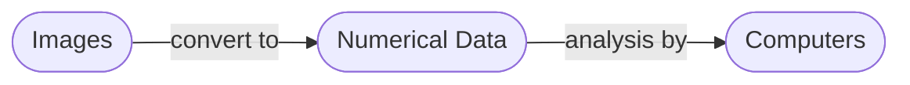

# Using The Camera
Raspbot V2 comes with a camera, connected directly to the Raspberry PI through USB.

To check whether the camera is connected, type the following into the terminal:

```bash
lsusb
```


To view images, we'll use `feh`:

```bash
sudo apt install feh
```

# Computer Vision

Computer vision is computation done on images.



This page will look at how to use computer vision from a high level, without diving into its theory.

We will use 2 popular computer vision library in python:
- OpenCV: contains many useful utilities for computer vision
```bash
pip install opencv-python
```
- mediapipe: contains algorithms for hand and posture tracking

```bash
pip install mediapipe
```

# OpenCV
We will use `OpenCV` to prepare images to feed into `mediapipe` which contains many machine learning algorithms for object detection, facial detection, etc.

The official `OpenCV` tutorial is linked [here](https://docs.opencv.org/4.x/d6/d00/tutorial_py_root.html).

## Opening Images And Writing To File
|Function|Details|
|---|---|
|`cv.imread`|imports an image given a path|
|`cv.imshow`|displays a window with an image given the window title and image object|
|`cv.cvtColor`|apply an operation over the whole image for a desired effect for instance, `cv.COLOR_BGR2GRAY` to grayscale an image. Other flags can be found [here](https://docs.opencv.org/3.4/d8/d01/group__imgproc__color__conversions.html).
|`cv.waitKey`|waits for a user input for an amount in miliseconds. If `0` is entered, it will wait indefinitely. Usually used to keep a display window open until user input is received.|
|`cv.imwrite`|writes an image to a path|

```python
import cv2 as cv

img = cv.imread("path/to/image.png")
# opening an image named 'image.png'
cv.imshow("Image: ", img)

# converting to grayscale
gray = cv.cvtColor(img, cv.COLOR_BGR2GRAY)
cv.imshow("Grayscaled Image: ", gray)

if cv.waitKey(0) == ord("s"):
    # writing the grayscaled image to 'output.png'
    cv.imwrite("path/to/output.png", gray)
```


## Opening A Camera

|Function|Details|
|---|---|
|`cv.VideoCapture`|input an index of a camera (in case for multiple camera in use, `0` if only one camera is connected). Returns an object stored in a variable called `cap`.|
|`cap.isOpened`|returns a boolean which states whether the camera has been opened or not.|
|`cap.read`|take a shot from the camera and receive the frame as an image. Returns a tuple `(ret, frame)`. `ret` is a boolean and `frame` is an image.|
|`cap.release`| closes the camera|
|`cv.destroyAllWindows`|destroys all windows|

```py
import numpy as np
import cv2 as cv
import sys

# argument is the index of camera (if have multiple cameras)
cap = cv.VideoCapture(0)
if not cap.isOpened():
    sys.exit("Can't open the camera for some reason")

try:
    while True:
        # ret is True or False for whether it is read correctly, somehow can also be used to check for the end of the footage??
        ret, frame = cap.read()

        if not ret:
            print("Can't receive frame. Exitting...")
            break

        gray = cv.cvtColor(frame, cv.COLOR_BGR2GRAY)

        cv.imshow("frame", gray)
        if cv.waitKey(1) == ord('q'):
            break
finally:
    cap.release()
    cv.destroyAllWindows()
```

# Writing A Video
Initialize writer object.
```python

# fourcc is 4-byte code used to speify the video codec
# codec: coder-decodertps://imgur.com/undefine
fourcc = cv2.VideoWriter_fourcc(*"XVID")
out = cv2.VideoWriter("output.avi", fourcc, 30.0, (frame_width, frame_height))
```

Writing a frame

```python
out.write(frame)
```

Once ready to close program:

```python
out.release()
```

## Drawing Over Frames

|Function|Details|
|---|---|
|`img.shape`|returns `(height, width, color_channels)`|
|`cv.line(img, (start_x, start_y), (end_x, end_y), (blue,green,red), line_width)`|draws a line over an image, distance in pixels|
|`cv.circle(img, (origin_x, origin_y), radius, (blue, green, red), border_width)`|`border_width = -1` to fill|
|`cv.ellipse(frame,(origin_x, origin_y),(major_x_axis,minor_y_axis),rotation_in_ccw,start_angle,end_angle,(blue, green, red), border_width)`|`border_width = -1` to fill|

Placing text over the frame:
```python
font = cv2.FONT_HERSHEY_SIMPLEX
color = (255, 255, 255)
font_scaling = 1
line_size_font = 3
x_axis_bottom_left = 480
y_axis_bottom_left = 0
cv2.putText(frame,'OpenCV',(x_axis_bottom_left, y_axis_bottom_left), font, font_scaling, color, line_size_font, cv2.LINE_AA)
```

# mediapipe

**MediaPipe** is an open-source tool for building and deploying machine learning pipelines. In our case, we will use **MediaPipe Solutions** which is a list of prebuilt libraries which also contains many computer vision applications.

More information about **MediaPipe Solutions** can be found on their [official website](https://ai.google.dev/edge/mediapipe/solutions/guide).

## Legacy Python Library

### Hands Position Recognition 

```python
import cv2   
import mediapipe as mp 
import time

# create Hands() object
hands = mp.solutions.hands.Hands()

# is used to draw on the img later on
mpdraw = mp.solutions.drawing_utils

capture = cv2.VideoCapture(0) 

while True:
  success, img = capture.read() 
  
  # convert from BGR to RGB
  imgRGB = cv2.cvtColor(img, cv2.COLOR_BGR2RGB) 
  
  # Takes in the RGB data and runs through some complex algorithms to return the cords of hand
  results = hands.process(imgRGB) 
  
  # print(results.multi_hand_landmarks)
  
  if (rs:=results.multi_hand_landmarks) != None:
    for handLandmarks in rs:
      mpdraw.draw_landmarks(img, handLandmarks, mp.solutions.hands.HAND_CONNECTIONS) # Place those points at the specified cord\
      # Connects the points of the hand
  cv2.imshow("Image", img) 
  # Show the image on a new window
  cv2.waitKey(1)  # Delay
```


**Note:** 
- will capture an indefinite amount of hands in the frame, stored in list `rs=results.multi_hand_landmarks`
- `handLandmarks.landmark` is a list containing 21 points that can be read and used as input to control many things such as the movement of the robot etc...
- To extract the coordinates `(x, y) = handLandmarks.landmarks[i].x, handLandmarks[i].y`


### Face Detection


```python
# code from official documentation

import cv2
import mediapipe as mp
mp_face_detection = mp.solutions.face_detection
mp_drawing = mp.solutions.drawing_utils

# For static images:
IMAGE_FILES = []
with mp_face_detection.FaceDetection(
    model_selection=1, min_detection_confidence=0.5) as face_detection:
  for idx, file in enumerate(IMAGE_FILES):
    image = cv2.imread(file)
    # Convert the BGR image to RGB and process it with MediaPipe Face Detection.
    results = face_detection.process(cv2.cvtColor(image, cv2.COLOR_BGR2RGB))

    # Draw face detections of each face.
    if not results.detections:
      continue
    annotated_image = image.copy()
    for detection in results.detections:
      print('Nose tip:')
      print(mp_face_detection.get_key_point(
          detection, mp_face_detection.FaceKeyPoint.NOSE_TIP))
      mp_drawing.draw_detection(annotated_image, detection)
    cv2.imwrite('/tmp/annotated_image' + str(idx) + '.png', annotated_image)

# For webcam input:
cap = cv2.VideoCapture(0)
with mp_face_detection.FaceDetection(
    model_selection=0, min_detection_confidence=0.5) as face_detection:
  while cap.isOpened():
    success, image = cap.read()
    if not success:
      print("Ignoring empty camera frame.")
      # If loading a video, use 'break' instead of 'continue'.
      continue
    # To improve performance, optionally mark the image as not writeable to
    # pass by reference.
    image.flags.writeable = False
    image = cv2.cvtColor(image, cv2.COLOR_BGR2RGB)
    results = face_detection.process(image)

    # Draw the face detection annotations on the image.
    image.flags.writeable = True
    image = cv2.cvtColor(image, cv2.COLOR_RGB2BGR)
    if results.detections:
      for detection in results.detections:
        mp_drawing.draw_detection(image, detection)
    # Flip the image horizontally for a selfie-view display.
    cv2.imshow('MediaPipe Face Detection', cv2.flip(image, 1))
    if cv2.waitKey(5) & 0xFF == 27:
        break
cap.release()
```


**Note:**

- All faces detected are stored in `results.detections` as a list
- printing `detection` results in something like this:
```
[label_id: 0
score: 0.876604617
location_data {
  format: RELATIVE_BOUNDING_BOX
  relative_bounding_box {
    xmin: 0.370108753
    ymin: 0.0518692285
    width: 0.318343133
    height: 0.42444551
  }
  relative_keypoints {
    x: 0.408133358
    y: 0.197097585
  }
  relative_keypoints {
    x: 0.507815838
    y: 0.152043656
  }
  relative_keypoints {
    x: 0.42386961
    y: 0.282291234
  }
  relative_keypoints {
    x: 0.464624107
    y: 0.367188513
  }
  relative_keypoints {
    x: 0.436898857
    y: 0.237854138
  }
  relative_keypoints {
    x: 0.674985
    y: 0.147426501
  }
}
]
```
- to get `label_id`, `score`, `location_data`, simply say `detection.label_id` etc...
- `detection.location_data.relative_keypoints` corresponds to right eye, left eye, nose tip, mouth center, right ear tragion, and left ear tragion; in that order.

### 468 landmark face mesh

```python
# code from official documentation
# https://github.com/google-ai-edge/mediapipe/blob/master/docs/solutions/face_mesh.md

import cv2
import mediapipe as mp
mp_drawing = mp.solutions.drawing_utils
mp_drawing_styles = mp.solutions.drawing_styles
mp_face_mesh = mp.solutions.face_mesh

# For static images:
IMAGE_FILES = []
drawing_spec = mp_drawing.DrawingSpec(thickness=1, circle_radius=1)
with mp_face_mesh.FaceMesh(
    static_image_mode=True,
    max_num_faces=1,
    refine_landmarks=True,
    min_detection_confidence=0.5) as face_mesh:
  for idx, file in enumerate(IMAGE_FILES):
    image = cv2.imread(file)
    # Convert the BGR image to RGB before processing.
    results = face_mesh.process(cv2.cvtColor(image, cv2.COLOR_BGR2RGB))

    # Print and draw face mesh landmarks on the image.
    if not results.multi_face_landmarks:
      continue
    annotated_image = image.copy()
    for face_landmarks in results.multi_face_landmarks:
      print('face_landmarks:', face_landmarks)
      mp_drawing.draw_landmarks(
          image=annotated_image,
          landmark_list=face_landmarks,
          connections=mp_face_mesh.FACEMESH_TESSELATION,
          landmark_drawing_spec=None,
          connection_drawing_spec=mp_drawing_styles
          .get_default_face_mesh_tesselation_style())
      mp_drawing.draw_landmarks(
          image=annotated_image,
          landmark_list=face_landmarks,
          connections=mp_face_mesh.FACEMESH_CONTOURS,
          landmark_drawing_spec=None,
          connection_drawing_spec=mp_drawing_styles
          .get_default_face_mesh_contours_style())
      mp_drawing.draw_landmarks(
          image=annotated_image,
          landmark_list=face_landmarks,
          connections=mp_face_mesh.FACEMESH_IRISES,
          landmark_drawing_spec=None,
          connection_drawing_spec=mp_drawing_styles
          .get_default_face_mesh_iris_connections_style())
    cv2.imwrite('/tmp/annotated_image' + str(idx) + '.png', annotated_image)

# For webcam input:
drawing_spec = mp_drawing.DrawingSpec(thickness=1, circle_radius=1)
cap = cv2.VideoCapture(0)
with mp_face_mesh.FaceMesh(
    max_num_faces=1,
    refine_landmarks=True,
    min_detection_confidence=0.5,
    min_tracking_confidence=0.5) as face_mesh:
  while cap.isOpened():
    success, image = cap.read()
    if not success:
      print("Ignoring empty camera frame.")
      # If loading a video, use 'break' instead of 'continue'.
      continue

    # To improve performance, optionally mark the image as not writeable to
    # pass by reference.
    image.flags.writeable = False
    image = cv2.cvtColor(image, cv2.COLOR_BGR2RGB)
    results = face_mesh.process(image)

    # Draw the face mesh annotations on the image.
    image.flags.writeable = True
    image = cv2.cvtColor(image, cv2.COLOR_RGB2BGR)
    if results.multi_face_landmarks:
      for face_landmarks in results.multi_face_landmarks:
        print(face_landmarks)
        mp_drawing.draw_landmarks(
            image=image,
            landmark_list=face_landmarks,
            connections=mp_face_mesh.FACEMESH_TESSELATION,
            landmark_drawing_spec=None,
            connection_drawing_spec=mp_drawing_styles
            .get_default_face_mesh_tesselation_style())
        mp_drawing.draw_landmarks(
            image=image,
            landmark_list=face_landmarks,
            connections=mp_face_mesh.FACEMESH_CONTOURS,
            landmark_drawing_spec=None,
            connection_drawing_spec=mp_drawing_styles
            .get_default_face_mesh_contours_style())
        mp_drawing.draw_landmarks(
            image=image,
            landmark_list=face_landmarks,
            connections=mp_face_mesh.FACEMESH_IRISES,
            landmark_drawing_spec=None,
            connection_drawing_spec=mp_drawing_styles
            .get_default_face_mesh_iris_connections_style())
    # Flip the image horizontally for a selfie-view display.
    cv2.imshow('MediaPipe Face Mesh', cv2.flip(image, 1))
    if cv2.waitKey(5) & 0xFF == 27:
      break
cap.release()

```

### Pose Detection

```python
# code snippet from official documentation
# https://github.com/google-ai-edge/mediapipe/blob/master/docs/solutions/holistic.md

import cv2
import mediapipe as mp
mp_drawing = mp.solutions.drawing_utils
mp_drawing_styles = mp.solutions.drawing_styles
mp_holistic = mp.solutions.holistic

# For static images:
IMAGE_FILES = []
BG_COLOR = (192, 192, 192) # gray
with mp_holistic.Holistic(
    static_image_mode=True,
    model_complexity=2,
    enable_segmentation=True,
    refine_face_landmarks=True) as holistic:
  for idx, file in enumerate(IMAGE_FILES):
    image = cv2.imread(file)
    image_height, image_width, _ = image.shape
    # Convert the BGR image to RGB before processing.
    results = holistic.process(cv2.cvtColor(image, cv2.COLOR_BGR2RGB))

    if results.pose_landmarks:
      print(
          f'Nose coordinates: ('
          f'{results.pose_landmarks.landmark[mp_holistic.PoseLandmark.NOSE].x * image_width}, '
          f'{results.pose_landmarks.landmark[mp_holistic.PoseLandmark.NOSE].y * image_height})'
      )

    annotated_image = image.copy()
    # Draw segmentation on the image.
    # To improve segmentation around boundaries, consider applying a joint
    # bilateral filter to "results.segmentation_mask" with "image".
    condition = np.stack((results.segmentation_mask,) * 3, axis=-1) > 0.1
    bg_image = np.zeros(image.shape, dtype=np.uint8)
    bg_image[:] = BG_COLOR
    annotated_image = np.where(condition, annotated_image, bg_image)
    # Draw pose, left and right hands, and face landmarks on the image.
    mp_drawing.draw_landmarks(
        annotated_image,
        results.face_landmarks,
        mp_holistic.FACEMESH_TESSELATION,
        landmark_drawing_spec=None,
        connection_drawing_spec=mp_drawing_styles
        .get_default_face_mesh_tesselation_style())
    mp_drawing.draw_landmarks(
        annotated_image,
        results.pose_landmarks,
        mp_holistic.POSE_CONNECTIONS,
        landmark_drawing_spec=mp_drawing_styles.
        get_default_pose_landmarks_style())
    cv2.imwrite('/tmp/annotated_image' + str(idx) + '.png', annotated_image)
    # Plot pose world landmarks.
    mp_drawing.plot_landmarks(
        results.pose_world_landmarks, mp_holistic.POSE_CONNECTIONS)

# For webcam input:
cap = cv2.VideoCapture(0)
with mp_holistic.Holistic(
    min_detection_confidence=0.5,
    min_tracking_confidence=0.5) as holistic:
  while cap.isOpened():
    success, image = cap.read()
    if not success:
      print("Ignoring empty camera frame.")
      # If loading a video, use 'break' instead of 'continue'.
      continue

    # To improve performance, optionally mark the image as not writeable to
    # pass by reference.
    image.flags.writeable = False
    image = cv2.cvtColor(image, cv2.COLOR_BGR2RGB)
    results = holistic.process(image)

    # Draw landmark annotation on the image.
    image.flags.writeable = True
    image = cv2.cvtColor(image, cv2.COLOR_RGB2BGR)
    mp_drawing.draw_landmarks(
        image,
        results.face_landmarks,
        mp_holistic.FACEMESH_CONTOURS,
        landmark_drawing_spec=None,
        connection_drawing_spec=mp_drawing_styles
        .get_default_face_mesh_contours_style())
    mp_drawing.draw_landmarks(
        image,
        results.pose_landmarks,
        mp_holistic.POSE_CONNECTIONS,
        landmark_drawing_spec=mp_drawing_styles
        .get_default_pose_landmarks_style())
    # Flip the image horizontally for a selfie-view display.
    cv2.imshow('MediaPipe Holistic', cv2.flip(image, 1))
    if cv2.waitKey(5) & 0xFF == 27:
      break
cap.release()

```
**Note:** 

- `results.pose_landmarks.landmark` will be a list of length 33 containing points listed below: 


- to access the coordinates `(x, y) = (results.pose_landmarks.landmark[i].x, results.pose_landmarks.landmark[i].y)`

## MediaPipe latest solutions
Solutions built into the python libraries are now considered `legacy`.

Converting an `OpenCV` image to a `mediapipe` image:

```python
rgb_frame = mp.Image(image_format=mp.ImageFormat.SRGB, data=cv_mat)
```
### Hands Detection
```python
#@markdown We implemented some functions to visualize the hand landmark detection results. <br/> Run the following cell to activate the functions.

from mediapipe import soluti_jons
from mediapipe.framework.formats import landmark_pb2
import numpy as np

MARGIN = 10  # pixels
FONT_SIZE = 1
FONT_THICKNESS = 1
HANDEDNESS_TEXT_COLOR = (88, 205, 54) # vibrant green

def draw_landmarks_on_image(rgb_image, detection_result):
  hand_landmarks_list = detection_result.hand_landmarks
  handedness_list = detection_result.handedness
  annotated_image = np.copy(rgb_image)

  # Loop through the detected hands to visualize.
  for idx in range(len(hand_landmarks_list)):
    hand_landmarks = hand_landmarks_list[idx]
    handedness = handedness_list[idx]

    # Draw the hand landmarks.
    hand_landmarks_proto = landmark_pb2.NormalizedLandmarkList()
    hand_landmarks_proto.landmark.extend([
      landmark_pb2.NormalizedLandmark(x=landmark.x, y=landmark.y, z=landmark.z) for landmark in hand_landmarks
    ])
    solutions.drawing_utils.draw_landmarks(
      annotated_image,
      hand_landmarks_proto,
      solutions.hands.HAND_CONNECTIONS,
      solutions.drawing_styles.get_default_hand_landmarks_style(),
      solutions.drawing_styles.get_default_hand_connections_style())

    # Get the top left corner of the detected hand's bounding box.
    height, width, _ = annotated_image.shape
    x_coordinates = [landmark.x for landmark in hand_landmarks]
    y_coordinates = [landmark.y for landmark in hand_landmarks]
    text_x = int(min(x_coordinates) * width)
    text_y = int(min(y_coordinates) * height) - MARGIN

    # Draw handedness (left or right hand) on the image.
    cv2.putText(annotated_image, f"{handedness[0].category_name}",
                (text_x, text_y), cv2.FONT_HERSHEY_DUPLEX,
                FONT_SIZE, HANDEDNESS_TEXT_COLOR, FONT_THICKNESS, cv2.LINE_AA)

  return annotated_image

import cv2
img = cv2.imread("../images/hand.png")
# STEP 1: Import the necessary modules.
import mediapipe as mp
from mediapipe.tasks import python
from mediapipe.tasks.python import vision

# STEP 2: Create an HandLandmarker object.
base_options = python.BaseOptions(model_asset_path='./models/hand_landmarker.task')
options = vision.HandLandmarkerOptions(base_options=base_options,
                                       num_hands=2)
detector = vision.HandLandmarker.create_from_options(options)

# STEP 3: Load the input image.
image = mp.Image.create_from_file("../images/hand.png")

# STEP 4: Detect hand landmarks from the input image.
detection_result = detector.detect(image)

# STEP 5: Process the classification result. In this case, visualize it.
annotated_image = draw_landmarks_on_image(cv2.cvtColor(image.numpy_view(), cv2.COLOR_RGB2BGR), detection_result)
cv2.imshow("frame", annotated_image )
cv2.waitKey(0)
cv2.destroyAllWindows()
```

### Face Detection

```python
# for visualization
from typing import Tuple, Union
import math
import cv2
import numpy as np

MARGIN = 10  # pixels
ROW_SIZE = 10  # pixels
FONT_SIZE = 1
FONT_THICKNESS = 1
TEXT_COLOR = (255, 0, 0)  # red


def _normalized_to_pixel_coordinates(
    normalized_x: float, normalized_y: float, image_width: int,
    image_height: int) -> Union[None, Tuple[int, int]]:
  """Converts normalized value pair to pixel coordinates."""

  # Checks if the float value is between 0 and 1.
  def is_valid_normalized_value(value: float) -> bool:
    return (value > 0 or math.isclose(0, value)) and (value < 1 or
                                                      math.isclose(1, value))

  if not (is_valid_normalized_value(normalized_x) and
          is_valid_normalized_value(normalized_y)):
    # TODO: Draw coordinates even if it's outside of the image bounds.
    return None
  x_px = min(math.floor(normalized_x * image_width), image_width - 1)
  y_px = min(math.floor(normalized_y * image_height), image_height - 1)
  return x_px, y_px


def visualize(
    image,
    detection_result
) -> np.ndarray:
  """Draws bounding boxes and keypoints on the input image and return it.
  Args:
    image: The input RGB image.
    detection_result: The list of all "Detection" entities to be visualize.
  Returns:
    Image with bounding boxes.
  """
  annotated_image = image.copy()
  height, width, _ = image.shape

  for detection in detection_result.detections:
    # Draw bounding_box
    bbox = detection.bounding_box
    start_point = bbox.origin_x, bbox.origin_y
    end_point = bbox.origin_x + bbox.width, bbox.origin_y + bbox.height
    cv2.rectangle(annotated_image, start_point, end_point, TEXT_COLOR, 3)

    # Draw keypoints
    for keypoint in detection.keypoints:
      keypoint_px = _normalized_to_pixel_coordinates(keypoint.x, keypoint.y,
                                                     width, height)
      color, thickness, radius = (0, 255, 0), 2, 2
      cv2.circle(annotated_image, keypoint_px, thickness, color, radius)

    # Draw label and score
    category = detection.categories[0]
    category_name = category.category_name
    category_name = '' if category_name is None else category_name
    probability = round(category.score, 2)
    result_text = category_name + ' (' + str(probability) + ')'
    text_location = (MARGIN + bbox.origin_x,
                     MARGIN + ROW_SIZE + bbox.origin_y)
    cv2.putText(annotated_image, result_text, text_location, cv2.FONT_HERSHEY_PLAIN,
                FONT_SIZE, TEXT_COLOR, FONT_THICKNESS)

  return annotated_image

IMAGE_FILE = '../images/faces.jpg'

import cv2

img = cv2.imread(IMAGE_FILE)
cv2.imshow("loaded image", img)
cv2.waitKey(0)

# STEP 1: Import the necessary modules.
import numpy as np
import mediapipe as mp
from mediapipe.tasks import python
from mediapipe.tasks.python import vision

# STEP 2: Create an FaceDetector object.
base_options = python.BaseOptions(model_asset_path='./models/detector.tflite')
options = vision.FaceDetectorOptions(base_options=base_options)
detector = vision.FaceDetector.create_from_options(options)

# STEP 3: Load the input image.
image = mp.Image.create_from_file(IMAGE_FILE)

# STEP 4: Detect faces in the input image.
detection_result = detector.detect(image)

# STEP 5: Process the detection result. In this case, visualize it.
image_copy = np.copy(image.numpy_view())
annotated_image = visualize(image_copy, detection_result)
rgb_annotated_image = cv2.cvtColor(annotated_image, cv2.COLOR_BGR2RGB)
cv2.imshow("faces annotated", rgb_annotated_image)
cv2.waitKey(0)
cv2.destroyAllWindows()
```

### Object Detection

```python
#@markdown We implemented some functions to visualize the object detection results. <br/> Run the following cell to activate the functions.
import cv2
import numpy as np

MARGIN = 10  # pixels
ROW_SIZE = 10  # pixels
FONT_SIZE = 1
FONT_THICKNESS = 1
TEXT_COLOR = (255, 0, 0)  # red


def visualize(
    image,
    detection_result
) -> np.ndarray:
  """Draws bounding boxes on the input image and return it.
  Args:
    image: The input RGB image.
    detection_result: The list of all "Detection" entities to be visualize.
  Returns:
    Image with bounding boxes.
  """
  for detection in detection_result.detections:
    # Draw bounding_box
    bbox = detection.bounding_box
    start_point = bbox.origin_x, bbox.origin_y
    end_point = bbox.origin_x + bbox.width, bbox.origin_y + bbox.height
    cv2.rectangle(image, start_point, end_point, TEXT_COLOR, 3)

    # Draw label and score
    category = detection.categories[0]
    category_name = category.category_name
    probability = round(category.score, 2)
    result_text = category_name + ' (' + str(probability) + ')'
    text_location = (MARGIN + bbox.origin_x,
                     MARGIN + ROW_SIZE + bbox.origin_y)
    cv2.putText(image, result_text, text_location, cv2.FONT_HERSHEY_PLAIN,
                FONT_SIZE, TEXT_COLOR, FONT_THICKNESS)

  return image

# loading the image

IMAGE_FILE = '../images/cats_and_dogs.jpg'

import cv2

img = cv2.imread(IMAGE_FILE)
cv2.imshow("loaded image", img)
cv2.waitKey(0)

# STEP 1: Import the necessary modules.
import numpy as np
import mediapipe as mp
from mediapipe.tasks import python
from mediapipe.tasks.python import vision

# STEP 2: Create an ObjectDetector object.
base_options = python.BaseOptions(model_asset_path='./models/efficientdet.tflite')
options = vision.ObjectDetectorOptions(base_options=base_options,
                                       score_threshold=0.5)
detector = vision.ObjectDetector.create_from_options(options)

# STEP 3: Load the input image.
image = mp.Image.create_from_file(IMAGE_FILE)

# STEP 4: Detect objects in the input image.
detection_result = detector.detect(image)
print(detection_result)
# STEP 5: Process the detection result. In this case, visualize it.
image_copy = np.copy(image.numpy_view())
annotated_image = visualize(image_copy, detection_result)
rgb_annotated_image = cv2.cvtColor(annotated_image, cv2.COLOR_BGR2RGB)
cv2.imshow("annotated image", rgb_annotated_image)
cv2.waitKey(0)
cv2.destroyAllWindows()
```

## Projects

### Face Tracking
Tracks a face and adjust the camera such that its pointing straight towards the face.

```python
from typing import Tuple, Union
import math
import cv2
import numpy as np
import Raspbot_Lib

MARGIN = 10  # pixels
ROW_SIZE = 10  # pixels
FONT_SIZE = 1
FONT_THICKNESS = 1
TEXT_COLOR = (255, 0, 0)  # red

def _normalized_to_pixel_coordinates(
    normalized_x: float, normalized_y: float, image_width: int,
    image_height: int) -> Union[None, Tuple[int, int]]:
  """Converts normalized value pair to pixel coordinates."""

  # Checks if the float value is between 0 and 1.
  def is_valid_normalized_value(value: float) -> bool:
    return (value > 0 or math.isclose(0, value)) and (value < 1 or
                                                      math.isclose(1, value))

  if not (is_valid_normalized_value(normalized_x) and
          is_valid_normalized_value(normalized_y)):
    # TODO: Draw coordinates even if it's outside of the image bounds.
    return None
  x_px = min(math.floor(normalized_x * image_width), image_width - 1)
  y_px = min(math.floor(normalized_y * image_height), image_height - 1)
  return x_px, y_px


def visualize(
    image,
    detection_result
) -> np.ndarray:
  """Draws bounding boxes and keypoints on the input image and return it.
  Args:
    image: The input RGB image.
    detection_result: The list of all "Detection" entities to be visualize.
  Returns:
    Image with bounding boxes.
  """
  annotated_image = image.copy()
  height, width, _ = image.shape

  for detection in detection_result.detections:
    # Draw bounding_box
    bbox = detection.bounding_box
    start_point = bbox.origin_x, bbox.origin_y
    end_point = bbox.origin_x + bbox.width, bbox.origin_y + bbox.height
    cv2.rectangle(annotated_image, start_point, end_point, TEXT_COLOR, 3)

    # Draw keypoints
    for keypoint in detection.keypoints:
      keypoint_px = _normalized_to_pixel_coordinates(keypoint.x, keypoint.y,
                                                     width, height)
      color, thickness, radius = (0, 255, 0), 2, 2
      cv2.circle(annotated_image, keypoint_px, thickness, color, radius)

    # Draw label and score
    category = detection.categories[0]
    category_name = category.category_name
    category_name = '' if category_name is None else category_name
    probability = round(category.score, 2)
    result_text = category_name + ' (' + str(probability) + ')'
    text_location = (MARGIN + bbox.origin_x,
                     MARGIN + ROW_SIZE + bbox.origin_y)
    cv2.putText(annotated_image, result_text, text_location, cv2.FONT_HERSHEY_PLAIN,
                FONT_SIZE, TEXT_COLOR, FONT_THICKNESS)

  return annotated_image

import numpy as np
import mediapipe as mp
from mediapipe.tasks import python
from mediapipe.tasks.python import vision

# STEP 2: Create an ObjectDetector object.
base_options = python.BaseOptions(model_asset_path='./models/detector.tflite')
options = vision.FaceDetectorOptions(base_options=base_options)
detector = vision.FaceDetector.create_from_options(options)
bot = Raspbot_Lib.Raspbot()

def adjust_servo(bot:Raspbot_Lib.Raspbot, current_coord:tuple, to_coord:tuple, current_angle:tuple, restriction:tuple) -> tuple:
    # servo 1 is y, servo 2 is pitch
    # servo 1 range from (0, 180)
    # servo 2 range from (0, 120)
    pixel_diff = (to_coord[0] - current_coord[0], to_coord[1] - current_coord[1])
    print(pixel_diff)
    speed = 0.20
    angle_diff = ((pixel_diff[0]/restriction[0])*180*speed, (pixel_diff[1]/restriction[1])*120*speed)
    print(angle_diff)
    clamp = lambda x, lower, upper: max(min(upper, x), lower)
    control_angle = (clamp(int(current_angle[0] - angle_diff[0]), 0, 180), clamp(int(current_angle[1] - angle_diff[1]), 0, 120))
    bot.Ctrl_Servo(1, control_angle[0])
    bot.Ctrl_Servo(2, control_angle[1])
    return control_angle 

# STEP 3: Load the input image
cap = cv2.VideoCapture(0)

try:
    if cap.isOpened():
        current_coord = (cap.get(cv2.CAP_PROP_FRAME_WIDTH)/2, cap.get(cv2.CAP_PROP_FRAME_HEIGHT)/2)
        print(current_coord)
        current_angle = (90, 40)
        adjust_servo(bot, (0, 0), (0, 0), current_angle, (1, 1))
        while True:
            ret, img = cap.read()
            if not ret:
                print("Can't receive frame. Exitting...")
                break

            mp_image = mp.Image(image_format=mp.ImageFormat.SRGB, data=img)
            detection_result = detector.detect(mp_image)
            if len(detection_result.detections) > 0:
                bbox = detection_result.detections[0].bounding_box
                to_coord = (bbox.origin_x + bbox.width/2, bbox.origin_y + bbox.height/2)
                current_angle = adjust_servo(bot, current_coord, to_coord, current_angle, (cap.get(cv2.CAP_PROP_FRAME_WIDTH), cap.get(cv2.CAP_PROP_FRAME_HEIGHT)))
            image_copy = np.copy(mp_image.numpy_view())
            annotated_image = visualize(image_copy, detection_result)
            cv2.imshow("annotated image", annotated_image)
            if cv2.waitKey(25) == ord('q'):
                break
finally:
    cap.release()
    cv2.destroyAllWindows()

```

**Useful Links:**

- [links to models](https://storage.googleapis.com/mediapipe-models/)
